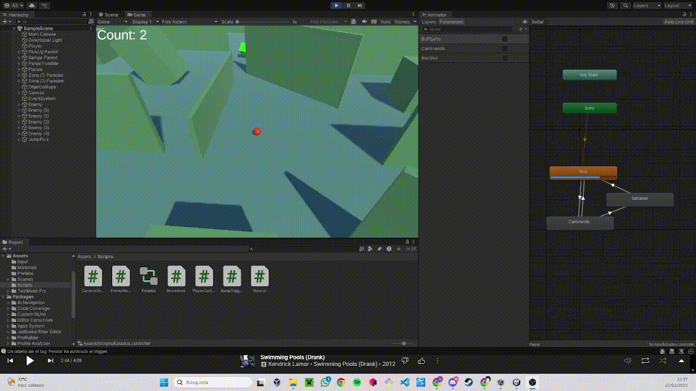

# Proyecto PMDM RollABall

## Descripción

Este proyecto es una implementación de un juego de tipo *Roll-a-ball* en Unity, donde se controla a una esfera que puede moverse en un entorno 3D y recoger objetos mientras escapa de enemigos. El juego también incluye dos tipos de cámaras: una en tercera persona y otra en primera persona, que el jugador puede alternar. El objetivo es familiarizarse con el uso de *Rigidbody*, control de entrada del teclado, y manejo de cámaras en Unity.

A mayores realice un objeto que al objtenerlo consigues la opción de realizar un salto, creación de un mapa, una pared invisible, una rampa para inpulsarte y que cuando los enemigos te tocan se reinicia el nivel.

<details>
    <summary><b>FUNCIONALIDADES IMPLEMENTADAS</b></summary>

</details>
<details>
      <summary><b>SCRIPTS UTILIZADOS</b></summary>


### `CameraController.cs`

El script `CameraController.cs` maneja la lógica de la cámara en el juego, permitiendo alternar entre una vista en tercera persona y una en primera persona.

---

### **1. Vista en Tercera Persona**:
- La cámara sigue al jugador manteniendo una distancia y un desplazamiento (`offset`) calculados al inicio.
- Se mantiene fija mirando al jugador para asegurar una vista clara del personaje.
- Al cambiar a tercera persona (`KeyCode.Alpha1`), la cámara regresa a su posición y rotación inicial.

---

### **2. Vista en Primera Persona**:
- La cámara se coloca sobre el jugador, a la altura definida por `heightOffset`, simulando la visión desde sus ojos.
- La rotación de la cámara responde a la entrada del ratón (`mouseX` y `mouseY`), permitiendo mirar en todas las direcciones.
- El jugador rota en el eje Y junto con la cámara.
- Se activa al presionar `KeyCode.Alpha2` y bloquea el cursor para una experiencia más inmersiva.

---

### **3. Movimiento en Primera Persona**:
- Utiliza `Input.GetAxis("Horizontal")` y `Input.GetAxis("Vertical")` para moverse en función de la dirección de la cámara.
- Se normalizan los vectores de movimiento para evitar cambios de altura.
- La velocidad de movimiento es controlada por `movementSpeed` y aplicada al `Rigidbody` del jugador.

---

### **4. Alternancia entre Modos**:
- `KeyCode.Alpha1`: Cambia a tercera persona, desbloqueando el cursor.
- `KeyCode.Alpha2`: Cambia a primera persona, bloqueando el cursor.

El script permite una transición fluida entre los modos y un control intuitivo del personaje en ambas vistas.

### `EnemyMovement.cs`

El script `EnemyMovement.cs` maneja el movimiento de los enemigos utilizando `NavMeshAgent`, permitiendo que persigan al jugador de manera automática.

---

### **1. Dependencias y Componentes**:
- Usa `NavMeshAgent` para el movimiento en un `NavMesh`.
- Requiere un `Transform` del jugador para establecer el destino.

---

### **2. Inicialización**:
- En `Start()`, obtiene la referencia del componente `NavMeshAgent`.

---

### **3. Lógica de Movimiento**:
- En `Update()`, verifica si el jugador no es `null`.
- Si el jugador existe, actualiza la posición del `NavMeshAgent` para que lo persiga.

---

### `Mouselook.cs`

El script `Mouselook.cs` maneja la rotación de la cámara en función del movimiento del mouse, permitiendo al jugador mirar alrededor en primera persona.

---

### **1. Funcionalidad Principal**:
- Controla la rotación de la cámara según el movimiento del mouse.
- Limita la rotación en el eje X para evitar giros de 360°.
- Rota el cuerpo del jugador en el eje Y para simular el giro horizontal.

---

### **2. Parámetros y Componentes**:
- `Sensibilidad`: Ajusta la velocidad de rotación del mouse.
- `playerBody`: Referencia al cuerpo del jugador para aplicar rotación horizontal.
- `xRotacion`: Almacena la rotación acumulada en el eje X para limitar la vista vertical.

---

### **3. Inicialización (`Start()`)**:
- Bloquea y oculta el cursor para mejorar la inmersión en el juego.

---

### **4. Lógica de Rotación (`Update()`)**:
- Obtiene la entrada del mouse en los ejes X e Y y ajusta la sensibilidad.
- Modifica `xRotacion` y la restringe dentro del rango `-90° a 90°`.
- Aplica la rotación vertical a la cámara y la horizontal al cuerpo del jugador.
- Imprime la rotación en el eje X para facilitar la depuración.

---

### `PlayerController.cs`

El script `PlayerController.cs` gestiona el movimiento del jugador, la detección de colisiones, la recolección de objetos y la interacción con la física en Unity.

---

### **1. Funcionalidad Principal**:
- Movimiento del jugador basado en la entrada del usuario.
- Detección de colisiones con enemigos, pickups y el suelo.
- Implementación del salto y su animación.
- Gestión de recolección de objetos y actualización del contador.
- Reinicio del jugador en caso de perder.

---

### **2. Parámetros y Componentes**:
- `rb`: Componente Rigidbody del jugador para aplicar física.
- `speed`: Velocidad de movimiento.
- `winTextObject`: Texto que indica la victoria o derrota.
- `countText`: Contador de pickups recogidos.
- `Pared_Invisible_0`: Objeto que se desactiva al recoger ciertos pickups.
- `jumpForce`: Fuerza del salto.
- `canJump`: Indica si el jugador puede saltar.
- `allPickups`: Lista de pickups en la escena.
- `allEnemies`: Lista de enemigos en la escena.
- `animation`: Controlador de animaciones.

---

### **3. Movimiento (`OnMove()`)**:
- Detecta la entrada del usuario y almacena la dirección del movimiento.
- Controla el estado de la animación según si el jugador se está moviendo.

---

### **4. Física (`FixedUpdate()`)**:
- Aplica fuerzas al Rigidbody del jugador para moverse.

---

### **5. Detección de Colisiones**:
- `OnCollisionEnter()`: Maneja colisiones con enemigos y el suelo.
- `OnTriggerEnter()`: Detecta pickups y habilita efectos como el salto.
- `OnCollisionStay()` y `OnCollisionExit()`: Gestiona el estado de contacto con el suelo.

---

### **6. Salto (`Jump()`)**:
- Aplica una fuerza vertical al jugador.
- Actualiza las animaciones correspondientes.

---

### **7. Reinicio del Jugador (`Respawn()`)**:
- Reinicia la posición y los valores del jugador al perder.
- Reactiva los pickups en la escena.

---

### **8. Animaciones (`UpdateAnimator()`)**:
- Controla la animación de caminar y el estado del salto.

---

### `RampTrigger.cs`

El script `RampTrigger.cs` gestiona la interacción entre la pelota y una rampa en el juego. Cuando la pelota entra en el área de colisión (trigger), se le aplica una fuerza para impulsarla en una dirección específica.

---

### Funcionalidad

1. Detección de colisión

   - El script utiliza `OnTriggerEnter(Collider other)` para detectar si un objeto entra en el trigger de la rampa.
   - Comprueba si el objeto tiene la etiqueta `Pelota` antes de aplicar la fuerza.

2. **Aplicación de fuerza**

   - Si el objeto tiene un `Rigidbody`, se le aplica una fuerza de impulso (`impulseForce`).
   - La fuerza puede aplicarse en relación al sistema de coordenadas de la rampa, si la opción `aplicarFuerzaRelativaRampa` está activada.

3. **Depuración y Mensajes**

   - Si el objeto no tiene un `Rigidbody`, se muestra un mensaje de advertencia en la consola.
   - También se registran mensajes en consola si un objeto sin la etiqueta `Pelota` activa el trigger.

---

### Variables Principales

- `impulseForce` (Vector3): Define la dirección y magnitud del impulso aplicado a la pelota.
- `aplicarFuerzaRelativaRampa` (bool): Determina si la fuerza debe ajustarse al sistema de coordenadas de la rampa.

---

### Métodos

#### `OnTriggerEnter(Collider other)`

- Comprueba si el objeto que entra en el trigger tiene la etiqueta `Pelota`.
- Obtiene su `Rigidbody` y aplica una fuerza de impulso.
- Si `aplicarFuerzaRelativaRampa` es `true`, la fuerza se ajusta a la orientación de la rampa.
- Muestra mensajes en consola si el objeto no tiene `Rigidbody` o no es una pelota.

### `Rotator.cs`

El script `Rotator.cs` rota un objeto de forma continua en los ejes X, Y y Z del espacio, ajustando la rotación por la tasa de frames para una rotación suave y consistente.

---

### Funcionalidad

#### **Rotación continua**
- El script rota el objeto en cada actualización del frame utilizando `transform.Rotate()`.
- La rotación se aplica en los ejes X, Y y Z con valores constantes (15, 30, 45), ajustados por `Time.deltaTime` para asegurar que la rotación sea independiente de la tasa de frames.

#### **Ajuste de rotación según frames**
- `Time.deltaTime` asegura que la rotación sea suave y consistente en cualquier tasa de frames, multiplicando las velocidades de rotación por el tiempo que ha pasado entre frames.

---

### Métodos

#### `Update()`
- Se llama una vez por frame y realiza la rotación continua del objeto en los ejes X, Y y Z.
- La rotación se ajusta según el valor de `Time.deltaTime` para garantizar un movimiento uniforme, sin importar los FPS del juego.

</details>
<details>
      <summary><b>USO DE ESTADOS</b></summary>

### **Uso de Estados**

**¿Por qué usar estados?**

En un videojuego, un personaje puede realizar varias acciones: caminar, saltar, caer, atacar, etc. Para gestionar estas acciones de manera eficiente y evitar conflictos entre ellas, se utilizan **estados**.

Ventajas de usar un sistema de estados:

✔ Código más organizado: Separa la lógica de cada acción del personaje.

✔ Evita errores: Controla las transiciones entre estados sin conflictos.

✔ Facilita la depuración: Es más fácil identificar problemas cuando cada acción tiene su propio estado.

✔ Escalabilidad: Permite agregar nuevos estados sin afectar los existentes.

**Uso de Estados en este Proyecto**
  
En este juego, el personaje tiene los siguientes estados:

1️⃣ Idle (Quieto)
👉 Cuando el jugador no se está moviendo ni saltando.

2️⃣ Walking (Caminando)
👉 Cuando el jugador se mueve con las teclas de dirección.
👉 Solo se activa si el jugador está en el suelo.

3️⃣ Jumping (Saltando)
👉 Se activa al presionar la barra espaciadora cuando el jugador está en el suelo.
👉 Mientras está en el aire por un salto, permanece en este estado.


**Como se gestionan los estados en el código**
El estado del jugador lo manejo con booleanos:
```bash
    private bool isGrounded = true;
    private bool isJumping = false;
    private bool isMoving = false;
```

**Transiciones entre Estados**
Los estados cambian bajo ciertas condiciones:

- Idle → Walking → Cuando el jugador presiona una tecla de movimiento.
- Walking → Jumping → Cuando el jugador presiona la tecla de salto y está en el suelo.
- Jumping → Idle → Walking → Cuendo el jugador salta.
Este cambio se actualiza en el método UpdateAnimator() que sincroniza el estado con las animaciones:

```bash
void UpdateAnimator()
{
        animation.SetBool("Caminando", isMoving && isGrounded);
        animation.SetBool("BuffSalto", isJumping);
}
```

**Animator Controller en Unity**

El Animator Controller es una herramienta en Unity que permite gestionar las animaciones de un personaje mediante un sistema de estados y transiciones. De esta manera se puede observar de manera muy visual los cambios de estados en el juego a medida que avanza.

      

</details>      
